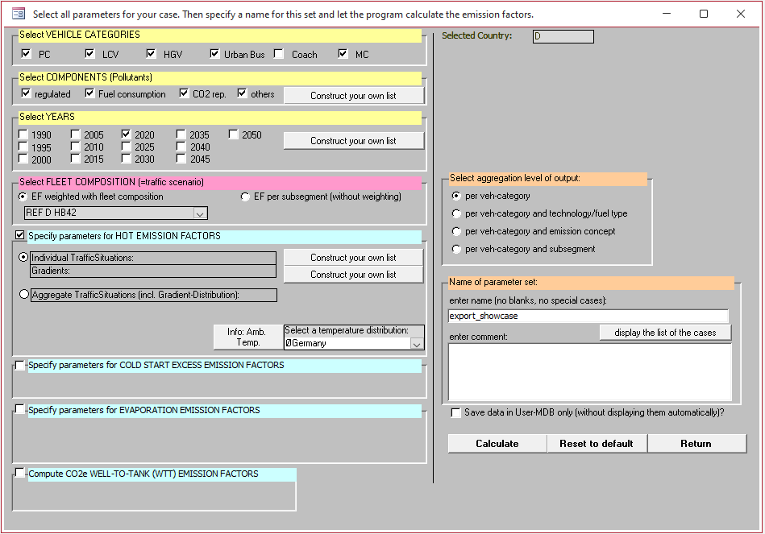
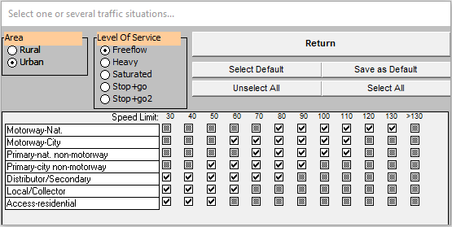
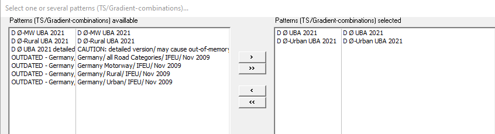
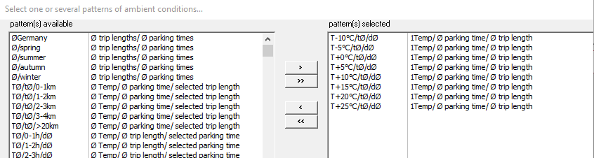
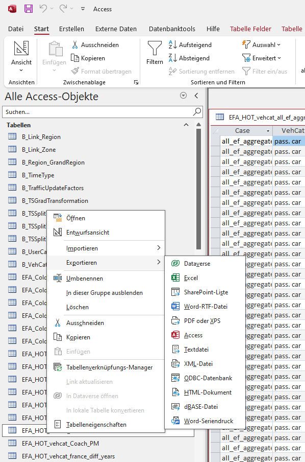

# HBEFA Emission Factor Database

This guide shows how to export the emission factors from the HBEFA 4.2 MS Access application. Please note that this requires a paid [HBEFA Licence](https://www.hbefa.net/en/software#licensing). We defined three cases (hot exhaust with individual traffic situations, hot exhaust with aggregated traffic situations and cold start excess emissions) and exported the emission factors as **.csv* tables.

## Define case for hot exhaust EF w. individual traffic situations
1. Open the HBEFA MS Access application and select your language and coutry. Use English as language in order to get attributes that are consistent with the documentation and the implemented modul.
2. Click "**New**" on the upper left corner, to define a new case. It will take some time to initialize the database and the interface.
3. HBEFA's main interface (see image below) will open and allow you to define your case. Select your vehicle categories, components and years of interest. HEBFA provides EF weighted with a predefined national fleet composition for selected countries. If your country is not supported by HBEFA, select "**EF per subsegment**" and assemble a fleet composition yourself. 

4. Construct your own list to define individual traffic situations and select all situations for all Levels of Service in the menu (see image below). 

5. Construct your on list of gradients if road gradient information is available in the traffic model. Otherwise, select the average gradient.
6. Enter a name for the parameter set and click "**Calculate**" to calculate the case.

## Define case for hot exhaust EF w. aggregated traffic situations
7. Follow steps 1-3 and define a new case. 
8. If your country is supported by HBEFA, you can select aggregated traffic situations for calculation. Select the aggregated traffic situation pattern of your country (see figure below).
9. Enter a name for the parameter set and click "**Calculate**" to calculate the case.

## Define case for cold start excess EF
10. Follow steps 1-3 and define a new case.
11. Unselect "**Specify parameters for HOT EMISSION FACTORS**" and select "**Specify parameters for COLD START EXCESS EMISSION FACTORS**"
12. Select all temperature specific cold start ef with average parking time and trip length unless you have other information for your country (see figure below).
9. Enter a name for the parameter set and click "**Calculate**" to calculate the case.

# Export of emission factors as *.csv table
1. To export the data go to "*C:/Programme(x86)/HBEFA/HBEFA 4.2/user/*" and open the "**HEBFA42_User.MDB**" access database. Here you should see all cases you defined previousl.
2. Right-click on the case you need toi export and select *Exportieren* > *Textdatei*. 
3. Move the exported files to the [hbefa folder](/data/restricted_input/hbefa/). 
4. Update the [data_paths.py](/utils/data_paths.py) file accordingly.
